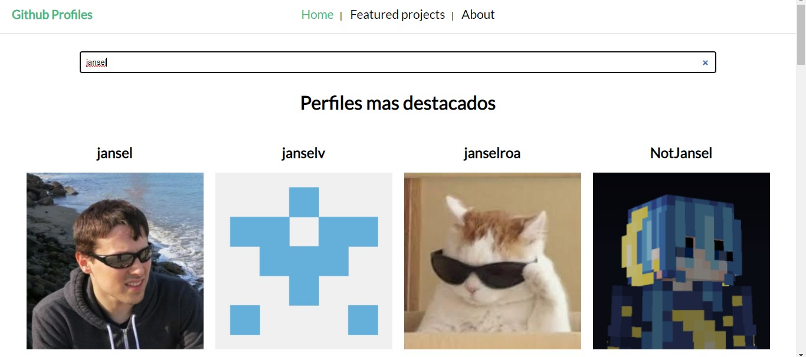

# github-profiles

<p>Tool for visualizing GitHub profiles</p>

### preview




### Download

```
git clone https://github.com/janselroa/github-profiles.git
```

```
cd github-profiles
```

## Project setup

```
yarn install
```

### Compiles and hot-reloads for development

```
yarn serve
```

### Compiles and minifies for production

```
yarn build
```

### Lints and fixes files

```
yarn lint
```

### Customize configuration

See [Configuration Reference](https://cli.vuejs.org/config/).
